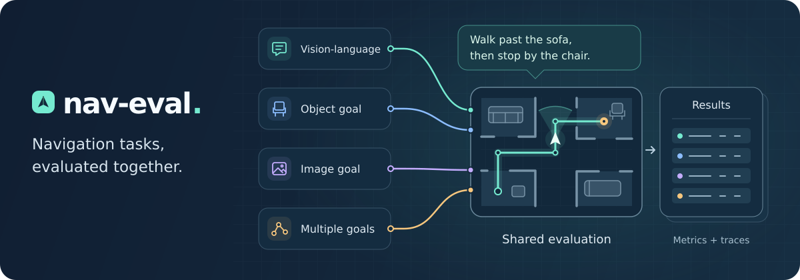
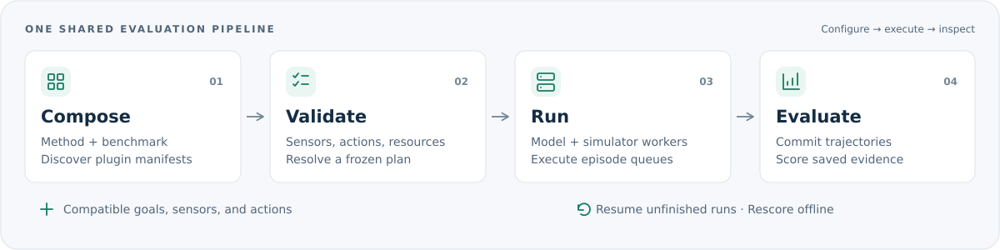

<p align="center">
  
</p>

<h1 align="center">Nav-Eval</h1>

<p align="center">
  <strong>One harness for embodied navigation evaluation.</strong><br>
  Compose compatible methods and benchmarks. Share configuration, execution, scoring, and trajectories.
</p>

<p align="center">
  <a href="LICENSE"></a>
  <a href="pyproject.toml"></a>
  <a href="#supported-methods"></a>
  <a href="#supported-benchmarks"></a>
</p>

<p align="center">
  <a href="#quick-start">🚀 Quick start</a> &nbsp;·&nbsp;
  <a href="#supported-benchmarks">🌍 Benchmarks</a> &nbsp;·&nbsp;
  <a href="#supported-methods">🤖 Methods</a> &nbsp;·&nbsp;
  <a href="#layout-and-documentation">📚 Documentation</a> &nbsp;·&nbsp;
  <a href="docs/integration.md">🧩 Add a plugin</a>
</p>

<p align="center">English &nbsp;|&nbsp; <a href="README.zh-CN.md">简体中文</a></p>

---

<a id="why-nav-eval"></a>

## 🧭 Why Nav-Eval

Evaluating a navigation model on a new benchmark usually means aligning camera protocols, action spaces, episode loops, and metric code by hand. Cross-paper comparisons then live in incompatible run trees. Nav-Eval brings that work into a shared plugin harness.

| 🧩 Compose plugins | 📦 Use bundled models | 🔁 Revisit every run |
|---|---|---|
| Methods implement **observe → act**; benchmarks provide episodes, sensors, and metrics. Pair them when goal types, sensors, and actions agree. | Inference source ships in the repository. No upstream checkout, editable install, or `PYTHONPATH` setup for model code. | Frozen decoding defaults, asset digests, and download receipts accompany each run. **Resume and rescore** saved trajectories. |

<p align="center">
  
</p>

Inference implementations live under `extensions/methods/<method>/runtime/`. See the [architecture guide](docs/architecture.md) for plugin boundaries, worker isolation, and evaluation evidence. SCAND uses recorded trajectories for offline scoring and needs no simulator.

<a id="supported-benchmarks"></a>

## 🌍 Supported benchmarks

Language, object, image, multigoal, and social navigation — across **Habitat**, **Isaac Sim**, and recorded real-world trajectories.

| Benchmark | Task | Backend | Guide |
|---|---|---|---|
| R2R-CE (`r2r_ce`) | Language-guided VLN | Habitat 0.2.4 / 0.3.0 | [Continuous VLN](docs/benchmarks.md#continuous-vln-r2r_ce-rxr_ce) |
| RxR-CE (`rxr_ce`) | Language-guided VLN, long instructions | Habitat 0.2.4 / 0.3.0 | [Continuous VLN](docs/benchmarks.md#continuous-vln-r2r_ce-rxr_ce) |
| ObjectNav (`objectnav`) | Object-goal (MP3D v1 / HM3D v2) | Habitat 0.2.4 / 0.3.0 | [ObjectNav](docs/benchmarks.md#objectnav-objectnav) |
| InstanceImageNav (`instance_imagenav`) | Instance image-goal | Habitat 0.2.4 / 0.3.0 | [InstanceImageNav](docs/benchmarks.md#instanceimagenav-instance_imagenav) |
| HM3D-OVON (`hm3d_ovon`) | Open-vocabulary object-goal | Habitat 0.2.4 / 0.3.0 | [Recipes](configs/benchmarks/README.md) |
| GOAT-Bench (`goat_bench`) | Multigoal (image + category + language) | Habitat 0.2.4 / 0.3.0 | [Recipes](configs/benchmarks/README.md) |
| MultiON MP3D (`multion`) | Multi-object navigation | Habitat 0.2.4 / 0.3.0 | [Recipes](configs/benchmarks/README.md) |
| MultiON HSSD (`multion`) | Multi-object navigation | Habitat 0.2.4 / 0.3.0 | [Recipes](configs/benchmarks/README.md) |
| HSSD SocialNav (`hssd_socialnav`) | Social navigation with humanoids | Habitat 0.3.0 | [SocialNav](docs/benchmarks.md#social-navigation-hssd_socialnav) |
| VLNVerse (`vlnverse`) | VLN in web scenes | Isaac Sim 5.0 | [VLN-VERSE](docs/benchmarks.md#vln-verse-vlnverse) |
| SCAND (`scand`) | Offline scoring of real-world trajectories | none | [SCAND](docs/benchmarks.md#scand-scand-offline-recorded-data-evaluation) |

Every Habitat benchmark ships bindings for both 0.2.4 and 0.3.0; SocialNav needs the Habitat 3 humanoid/rearrangement APIs and is 0.3.0-only. Version-specific JSON configurations are listed in the [benchmark recipes](configs/benchmarks/README.md). OVON and GOAT additionally install task source snapshots with `scripts/setup_benchmark.py`.

<a id="supported-methods"></a>

## 🤖 Supported methods

**11 method adapters**, with each method's observation contract and native image geometry listed below.

| Method | Goal inputs | Policy observations | Native image / HFOV | Model environment | Upstream |
|---|---|---|---|---|---|
| StreamVLN | language | RGB | 640×480 / 79° | `nav_streamvln` | [StreamVLN](https://github.com/InternRobotics/StreamVLN) |
| GA-VLN | language | RGB, depth, pose | 640×480 / 79° | `nav_streamvln` | [GA-VLN](https://github.com/jahhaoyang/GA-VLN) |
| NaVid | language, category | RGB | 640×480 / 90° | `nav_vlm` | [NaVid](https://github.com/jzhzhang/NaVid-VLN-CE) |
| Uni-NaVid | language, category | RGB | 640×480 / 120° | `nav_vlm` | [NaVid](https://github.com/jzhzhang/NaVid-VLN-CE) |
| NaVILA | language | RGB | 512×512 / 90° | `nav_vlm` | [NaVILA](https://github.com/AnjieCheng/NaVILA) |
| AwareVLN | language | RGB | 512×512 / 90° | `nav_vlm` | [AwareVLN](https://github.com/GWxuan/AwareVLN) |
| NaVIDA | language | RGB | 640×480 / 90° | `nav_vlm` | [Paper](https://arxiv.org/abs/2601.18188) |
| ActiveVLN | language | RGB | 640×480 / 90° | `nav_vlm` | — |
| JanusVLN | language | RGB | 640×480 / 79° | `nav_vlm` | [JanusVLN](https://github.com/MIV-XJTU/JanusVLN) |
| InternVLA-N1 | language | RGB, depth; camera tilt probes | 640×480 / 79° | `nav_vlm` | [InternNav](https://github.com/InternRobotics/InternNav) |
| OneVLA | language | RGB | 640×480 / 90° | `nav_vlm` | [OneVLA](https://github.com/linglingxiansen/OneVLA) |

The table lists adapter input contracts, not verified performance. GA-VLN supports the Habitat VLN bindings only and **is not supported on Isaac Sim / VLNVerse**, whose policy interface does not expose pose. InternVLA-N1 requires `benchmark_settings.allow_tilt: true`. Other methods run on the VLN bindings whenever image geometry and action semantics match — but a working import or a passing smoke run says nothing about navigation performance.

<details>
<summary><strong>🔬 Simulator signals, action geometry, and protocol conventions</strong></summary>

| VLN simulator binding | Policy-visible signals | Actions and geometry |
|---|---|---|
| Habitat 0.2.4 / 0.3.0 | RGB `uint8`; optical-axis depth `float32` in metres; optional pose `[x,y,z,qw,qx,qy,qz]` | 0.25 m forward, 15° or 30° turns, STOP; optional ±15° camera tilt; configurable image size/HFOV |
| Isaac Sim 5.0 / VLNVerse H1 | RGB `uint8`; optional optical-axis depth `float32` in metres (upstream normalized depth is converted back to metres); no policy pose | Physical H1 controller, nominal 0.25 m / 15°; logical 30° turns execute two controls; STOP and optional ±15° tilt; fixed 90° HFOV |

Conventions shared by both bindings:

- **Pose is ground truth, not odometry.** Habitat pose comes from the simulator's Y-up world frame; quaternion components are dimensionless. Goal coordinates, reference paths, geodesic distances and Isaac GPS stay in evaluator evidence and are never sent to the policy.
- **Observations carry no image history.** Each frame includes episode/sequence IDs and `control_tick`; `sim_time_s` is null. Each method maintains its own image history.
- **Navigation actions and camera probes are counted separately.** All controls run under a finite watchdog, and existing explicit smoke step limits remain in effect.
- **Initial camera pitch is configurable (VLNVerse only).** The USD camera's −30° mount is kept by default; `camera_pitch_deg: 0` explicitly selects a horizontal initial view, recorded in the experiment identity.
- **`robot_flash: true` is experimental.** It selects the upstream discrete flash controller with collision checks enabled; camera probes only render and do not advance physics. Report these results separately from physical H1 runs.

</details>

Weight sources and per-method checkpoint layouts: [Assets — model weights](data/README.md#3-model-weights) and [Deployment — method environments](docs/deployment.md#method-environments). Match the method's goal inputs to the benchmark's task type; shipped method × benchmark pairs are listed in [`configs/experiments/`](configs/experiments).

<a id="quick-start"></a>

## 🚀 Quick start

**Install → download → register → evaluate.** For StreamVLN or GA-VLN on R2R/RxR, start with the `streamvln habitat024` environment profile below.

### 1. Install environments

System requirements: Linux, Conda, a C++ compiler, CUDA 12.8 Toolkit, an NVIDIA Ampere-or-newer GPU. Run from the repository root:

```bash
export CUDA_HOME=/usr/local/cuda-12.8
bash scripts/setup_environment.sh streamvln habitat024   # envs/nav_streamvln
bash scripts/setup_environment.sh vlm                    # envs/nav_vlm
bash scripts/setup_environment.sh habitat030             # envs/nav_habitat030
```

| Environment | Covers | Python |
|---|---|---|
| `envs/nav_streamvln` | StreamVLN, GA-VLN; Habitat 0.2.4 simulator worker for all methods | 3.9 |
| `envs/nav_vlm` | NaVid, Uni-NaVid, NaVILA, AwareVLN, NaVIDA, ActiveVLN, JanusVLN, InternVLA-N1, OneVLA | 3.10 |
| `envs/nav_habitat030` | Habitat 0.3.0 simulator worker for all methods, incl. SocialNav | 3.9 |
| `envs/nav_isaac` | VLNVerse simulator worker (optional) | 3.11 |

Models and simulators run in separate environments and share `data/`; each method × benchmark pair must satisfy sensor and action capabilities. StreamVLN or GA-VLN on R2R/RxR needs only the first command. Dependency recipes: [Deployment — method environments](docs/deployment.md#method-environments).

### 2. Download data and weights

Follow the [asset guide](data/README.md): episode datasets (§1), licensed MP3D/HM3D/HSSD scenes (§2), model weights (§3). StreamVLN weights on R2R-CE `val_unseen`:

```bash
mkdir -p checkpoints
python -B -c 'from huggingface_hub import snapshot_download; snapshot_download(repo_id="mengwei0427/StreamVLN_Video_qwen_1_5_r2r_rxr_envdrop_scalevln", local_dir="checkpoints/streamvln")'
```

Resulting layout:

```text
checkpoints/streamvln/config.json
data/datasets/r2r/val_unseen/val_unseen.json.gz
data/scene_datasets/mp3d/<scan>/<scan>.glb
data/scene_datasets/mp3d/<scan>/<scan>.navmesh
```

### 3. Register once

```bash
METHOD=streamvln SIMULATOR=habitat024 bash scripts/register_assets.sh
python -B -m nav_eval configure --simulator habitat030 \
  --environment-python envs/nav_habitat030/bin/python --data-root data
```

Registration writes the Git-ignored `configs/local.json`; every later run reads it automatically. Extra weight paths (GA-VLN's `vision_tower` and `vggt_path`, NaVid's `vision_tower`) go through `bash scripts/register_assets.sh --method-path KEY=PATH`. Details: [Assets — register](data/README.md#4-register-once-after-downloading).

### 4. Run inference and evaluation

```bash
# model inference in the simulator, then scoring
METHOD=streamvln BENCHMARK=r2r_ce GPU=0 bash scripts/eval.sh

# per-method shortcut, same effect
GPU=0 bash scripts/methods/streamvln.sh

# batch several pairs (edit the list inside the script)
GPU=0 bash scripts/eval_suite.sh
```

`MODE=plan` resolves a pair without starting any workers. Default R2R runs 33 diagnostic episodes; `CONFIG=configs/experiments/streamvln-r2r-full.json` selects all 1,839. Methods without a full configuration need an explicit `CONFIG` or `SMOKE_OK=1`. Resume an interrupted run, or rescore saved trajectories:

```bash
python -B -m nav_eval resume --run 'runs/streamvln-r2r/<run-id>'
python -B -m nav_eval evaluate --run 'runs/streamvln-r2r/<run-id>'
```

Multi-GPU parallel runs, shared-model batching and Docker: [Real runs](docs/deployment.md#real-runs) · [Parallel inference](docs/deployment.md#parallel-inference) · [Docker](docs/deployment.md#docker).

### Specialized benchmarks

- **OVON / GOAT / MultiON**: `python -B scripts/setup_benchmark.py hm3d_ovon` (likewise `goat_bench`, `multion_hssd`) installs task source snapshots; downloads and dual-version JSONs are in the [recipes](configs/benchmarks/README.md#environments-and-configurations).
- **VLNVerse**: `bash scripts/setup_environment.sh isaac` creates `envs/nav_isaac` (Isaac Sim 5.0 + InternUtopia). The robot embodiment is a gated dataset — request access at [Embodiments](https://huggingface.co/datasets/InternRobotics/Embodiments) in the browser first, then:

```bash
python -B scripts/setup_benchmark.py vlnverse
envs/nav_streamvln/bin/hf auth login
envs/nav_streamvln/bin/python -B scripts/download_vlnverse_smoke.py
METHOD=streamvln BENCHMARK=vlnverse GPU=0 \
  CONFIG=configs/experiments/streamvln-vlnverse-smoke.json bash scripts/eval.sh
```

`HF_ENDPOINT=https://hf-mirror.com` reroutes the public-split downloads. Full guide: [VLN-VERSE](docs/benchmarks.md#vln-verse-vlnverse).

Notes on the H1 embodiment data:

- `hf auth login` must use a read token from the same account that requested access — a token alone does not grant gated access.
- Local tests reuse the already-downloaded `data/Embodiments/vln-pe/h1/`; [asset provenance and validation](docs/vlnverse-validation.md) are recorded separately from online download receipts.
- Once authorized, `hf download InternRobotics/Embodiments --repo-type dataset --include 'vln-pe/h1/**' --local-dir data/downloads/embodiments-authorized` fetches a separate copy and leaves existing files untouched; the web downloader refuses to overwrite files without its own receipt.

Native VLNVerse configurations cover StreamVLN, NaVIDA, AwareVLN, JanusVLN, NaVid, Uni-NaVid and InternVLA-N1. A 30° turn issues two 15° controller calls within one policy decision; InternVLA explicitly enables depth and camera tilt. See [measured results and limits](docs/vlnverse-validation.md) for full-budget diagnostics, reproducible configurations and remaining protocol differences.

- **SCAND**: offline ADE/FDE scoring of recorded trajectories, no simulator needed — [SCAND guide](docs/benchmarks.md#scand-scand-offline-recorded-data-evaluation).

<a id="layout-and-documentation"></a>

## 📚 Layout and documentation

| Guide | Start here to… |
|---|---|
| 🏗️ [Architecture](docs/architecture.md) | Understand plugins, worker isolation, and the execution pipeline |
| 🌍 [Benchmarks](docs/benchmarks.md) | Choose a task and check its simulator requirements |
| ⚙️ [Deployment and Docker](docs/deployment.md) | Set up environments, parallel inference, and containers |
| 📦 [Assets](data/README.md) | Download datasets, scenes, and weights; register local paths |
| 🧩 [Integration guide](docs/integration.md) | Add a method, benchmark, simulator, or metric |

<details>
<summary><strong>🗂️ Repository map</strong></summary>

```text
nav_eval/       Shared evaluation runtime
extensions/     Method, benchmark, simulator, metric, and controller plugins
configs/        Experiment and resource configurations
scripts/        Setup, registration, and evaluation entry points
data/           Datasets and scenes
checkpoints/    Model weights
envs/nav_*/     Isolated runtime environments
runs/           Trajectories, evidence, and scores
```

</details>

## 📄 License

[Apache 2.0](LICENSE) for Nav-Eval's original code. Bundled inference source retains upstream terms in each runtime's `provenance.json` and `notices/`; data and weights follow their upstream licenses.
